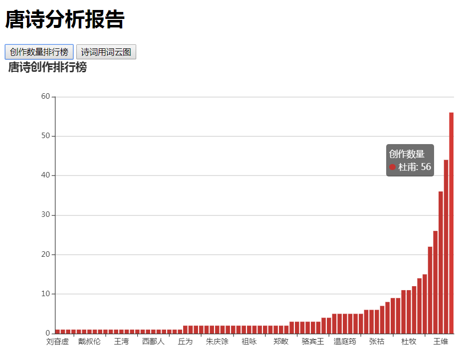
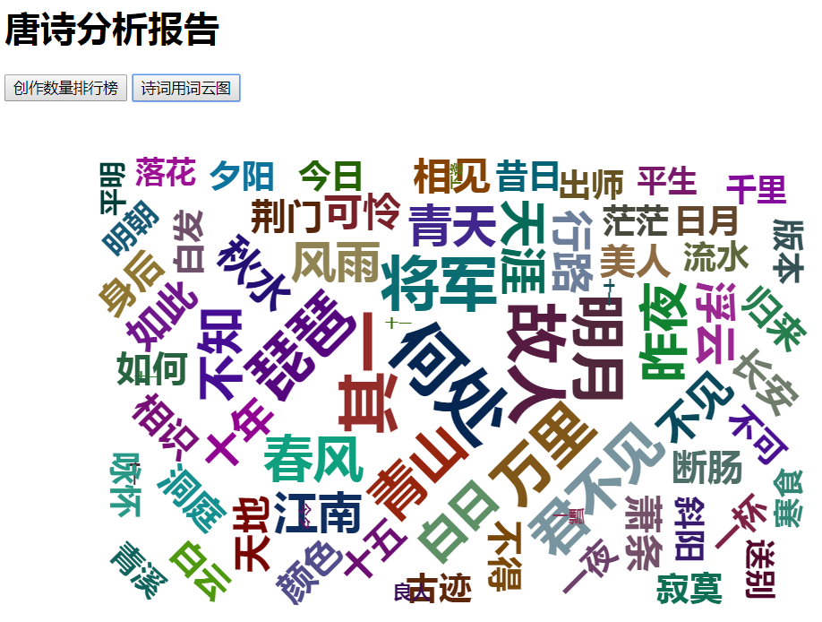

# 项目名称
**唐韵**
# 项目描述
这是一款可以爬取古诗文网中唐诗页面中所有唐诗信息的一款爬虫软件
# 涉及技术
+ JavaSE基础知识,包括多线程,集合框架,设计模式等..
+ MySQL,包括表的设计,数据的插入和查询.
+ JDBC技术
+ 第三方工具,包括htmlUnit,ansj分词技术,sparkjava,Druid(数据库链接池)
+ 前端,包括html,JavaScript,JQuery,Echarts  
# 功能
+ 从指定网页(https://so.gushiwen.org/gushi/tangshi.aspx)爬取所有唐诗
+ 将爬取的所有唐诗进行数据分析
+ 整理出每一个作者的作品数生成一个柱状图
+ 根据所有诗中关键字出现的频率生成云图
# 具体实现流程图

# 最终结果展示  
+ 作者与诗词数量柱状图 

+ 所有唐诗中词语出现频率云图
  
# 附:数据采集网址
[古诗文网_唐诗三百首](https://so.gushiwen.org/gushi/tangshi.aspx)

